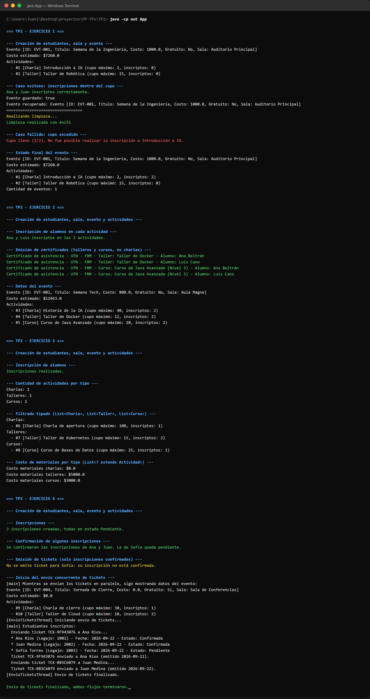

# TP2 - Programación Orientada a Objetos en Java

Trabajo Práctico N°2 de la cátedra **Paradigmas de Programación** (UTN - FRM), Unidad 2: Organización, reutilización y recursos avanzados en POO.

Este proyecto escala el modelo desarrollado en el [TP1](https://github.com/juanigarciadev/PP-TP1-53555), incorporando manejo de packages, excepciones y persistencia por serialización (Ejercicio 1), interfaces (Ejercicio 2), genéricos acotados y wildcards (Ejercicio 3), y clases anidadas junto con hilos (Ejercicio 4).

## Estado actual

| Ejercicio | Descripción | Estado |
|---|---|---|
| 1 | Packages, excepción `CupoExcedidoException` y persistencia por serialización | ✅ Completo |
| 2 | Interfaz `Certificable`, nuevo tipo de actividad `Curso` y emisión de certificados | ✅ Completo |
| 3 | Métodos genéricos acotados y wildcards (`filtrarActividadesPorTipo`, `calcularCostoMateriales`) | ✅ Completo |
| 4 | Clase anidada `Inscripcion.TicketDeAcceso` e hilo `EnvioTicketsThread` | ✅ Completo |

## Cómo ejecutar

Abrir el proyecto en IntelliJ IDEA y correr `App.java` (contiene el `main`). Ejecuta los 4 ejercicios en orden, uno atrás del otro, cada uno con sus propios datos de prueba armados en el código. No requiere ingresar nada por teclado.

### Captura de una ejecución

## Estructura del proyecto

**Packages:**
- `modelo`: `EventoUniversitario`, `Sala`, `Estudiante`, `Inscripcion` (con su clase anidada `Inscripcion.TicketDeAcceso`).
- `modelo.actividades`: `Actividad` (abstracta), `Charla`, `Taller`, `Curso`.
- `excepciones`: `CupoExcedidoException`, excepción chequeada (extiende `Exception`) que se lanza al superar el cupo máximo de una actividad al inscribir.
- `certificacion`: interfaz `Certificable`, implementada por `Taller` y `Curso` (no por `Charla`).
- `hilos`: `EnvioTicketsThread`, hilo independiente que envía los tickets de acceso de un evento.
- `App` y `Utilidades` quedan en el paquete por defecto.

**Modelo:**
- `EventoUniversitario`: evento con ID, título, costo base, gratuidad, sala (agregación) y actividades (composición). Contador estático de instancias, constructor de copia, `calcularCostoEstimado()`. Persiste/recupera por serialización con `persistirEvento()` / `recuperarEvento(id)`, con manejo granular de excepciones de E/S. Incorpora `filtrarActividadesPorTipo(Class<T> tipo)` (genérico acotado) y `calcularCostoMateriales(List<? extends Actividad>)` (wildcard).
- `Actividad`: clase abstracta con `Charla`, `Taller` y `Curso` como subclases concretas (herencia y polimorfismo). `inscribir(...)` lanza `CupoExcedidoException` si se supera el cupo. Las inscripciones se crean en estado `"Pendiente"` y se confirman explícitamente con `Inscripcion.confirmar()`.
- `Taller` y `Curso` implementan `Certificable` (`generarCertificado(Estudiante)`); `Charla` no, porque no es certificable.
- `Inscripcion`: vincula un estudiante con una actividad, con fecha y estado. `emitirTicket()` genera un `TicketDeAcceso` (clase anidada miembro) únicamente si la inscripción está confirmada; devuelve `null` en caso contrario.
- `Inscripcion.TicketDeAcceso`: clase anidada no estática, solo tiene sentido en el contexto de una inscripción concreta, y por eso accede directamente al `Estudiante` de su inscripción sin necesitar una referencia explícita. Expone `enviarTicket()`.
- `Sala`, `Estudiante`: igual que en TP1.

**Excepciones y persistencia (Ejercicio 1):** `Actividad.inscribir(...)` declara `throws CupoExcedidoException`; se atrapa en `App` en dos casos independientes (uno exitoso, uno fallido por cupo excedido). `EventoUniversitario.persistirEvento()`/`recuperarEvento(id)` usan `ObjectOutputStream`/`ObjectInputStream`, distinguiendo `FileNotFoundException` del resto de `IOException`. En `App` hay un bloque `try-catch-finally` que inscribe, persiste y lee un evento, y en el `finally` borra el archivo `.dat` generado para no dejar basura en el repo.

**Concurrencia (Ejercicio 4):** `EnvioTicketsThread extends Thread` recorre las actividades de un evento y envía (con una pequeña demora simulada) el ticket de cada inscripción confirmada. Se lanza con `.start()` desde `App`, y mientras corre, el hilo principal sigue mostrando por consola los datos del evento y sus inscriptos. Ambos flujos quedan identificados en la salida con `[main]` y `[EnvioTicketsThread]`.
